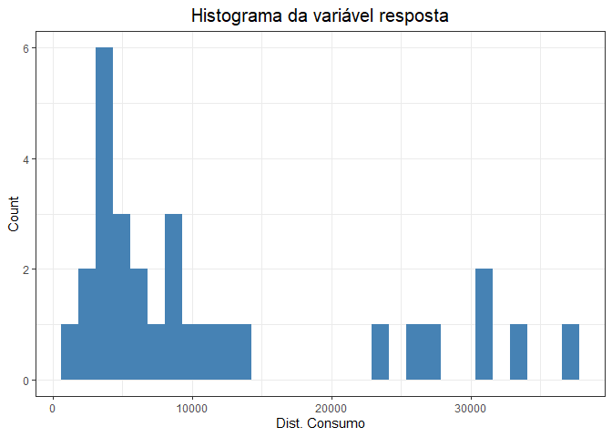
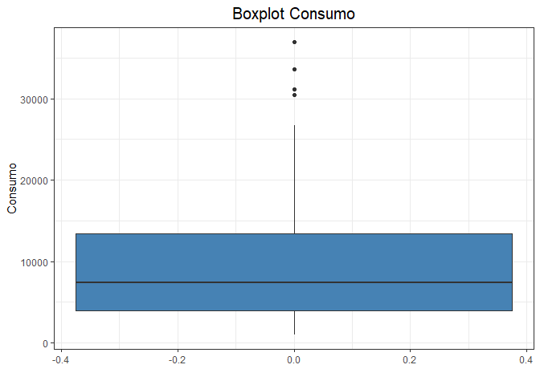
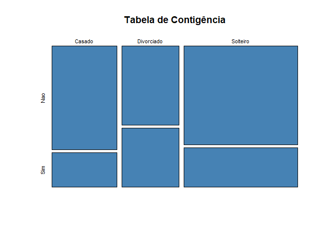
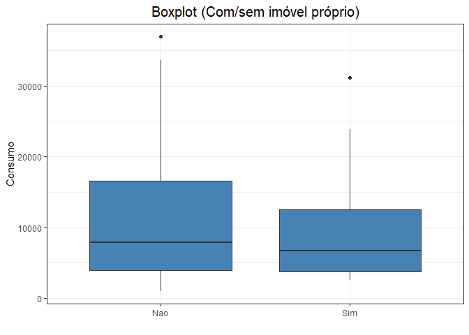
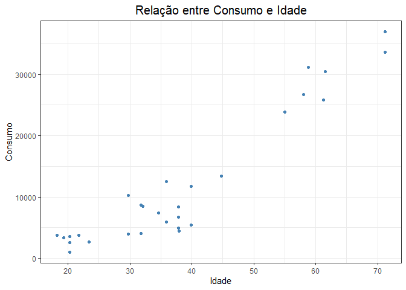

<!-- README.md is generated from README.Rmd. Please edit that file -->

# Consumo

``` r
library(tidyverse)
library(plotly)
library(skimr)
```

#### Visão geral dos dados:

``` r
glimpse(dados)
#> Rows: 29
#> Columns: 6
#> $ Consumo               <dbl> 2595, 8470, 4007, 6734, 33628, 3903, 13444, 1256~
#> $ Estado_Civil          <chr> "Divorciado", "Casado", "Divorciado", "Casado", ~
#> $ Genero                <chr> "Feminino", "Feminino", "Masculino", "Feminino",~
#> $ Idade                 <dbl> 20.25858, 32.11184, 31.74676, 37.81985, 71.20830~
#> $ Renda_Mensal          <dbl> 1985.882, 3769.248, 2291.881, 2390.403, 8534.717~
#> $ Possui_Imovel_Proprio <chr> "Sim", "Sim", "Nao", "Sim", "Nao", "Nao", "Nao",~
```

``` r
skim(dados)
```

|                                                  |       |
|:-------------------------------------------------|:------|
| Name                                             | dados |
| Number of rows                                   | 29    |
| Number of columns                                | 6     |
| \_\_\_\_\_\_\_\_\_\_\_\_\_\_\_\_\_\_\_\_\_\_\_   |       |
| Column type frequency:                           |       |
| character                                        | 3     |
| numeric                                          | 3     |
| \_\_\_\_\_\_\_\_\_\_\_\_\_\_\_\_\_\_\_\_\_\_\_\_ |       |
| Group variables                                  | None  |

Data summary

**Variable type: character**

| skim\_variable          | n\_missing | complete\_rate | min | max | empty | n\_unique | whitespace |
|:------------------------|-----------:|---------------:|----:|----:|------:|----------:|-----------:|
| Estado\_Civil           |          0 |              1 |   6 |  10 |     0 |         3 |          0 |
| Genero                  |          0 |              1 |   8 |   9 |     0 |         2 |          0 |
| Possui\_Imovel\_Proprio |          0 |              1 |   3 |   3 |     0 |         2 |          0 |

**Variable type: numeric**

| skim\_variable | n\_missing | complete\_rate |     mean |       sd |      p0 |     p25 |     p50 |      p75 |     p100 | hist  |
|:---------------|-----------:|---------------:|---------:|---------:|--------:|--------:|--------:|---------:|---------:|:------|
| Consumo        |          0 |              1 | 11916.93 | 10909.84 | 1019.00 | 3903.00 | 7430.00 | 13444.00 | 36936.00 | ▇▃▁▂▂ |
| Idade          |          0 |              1 |    38.55 |    15.71 |   18.24 |   29.72 |   35.84 |    44.81 |    71.21 | ▅▇▂▂▂ |
| Renda\_Mensal  |          0 |              1 |  3964.73 |  2106.34 | 1635.65 | 2291.88 | 3575.98 |  5714.55 |  8534.72 | ▇▃▂▃▁ |

#### Primeiro: Inspecionar a variável resposta para esse modelo é (Consumo)

``` r
  dados %>% 
  ggplot()+
  aes(Consumo)+
  geom_histogram(fill = '#4682B4')+
  theme_bw()+
  labs(
    x = "Dist. Consumo",
    y = "Count",
    title = "Histograma da variável resposta"
  )+
  theme(
  plot.title = element_text(
    hjust = 0.5,
    size = 15
  ))
```

<!-- -->

``` r
  
dados %>% 
  ggplot()+
  aes(y = Consumo)+
  geom_boxplot(fill = '#4682B4')+
  theme_bw()+
  labs(
    x = " ",
    y = "Consumo",
    title = "Boxplot Consumo"
  )+
  theme(
  plot.title = element_text(
    hjust = 0.5,
    size = 15
  ))
```

<!-- -->

#### Verificando a correlação entre as variáveis preditoras:

``` r
tabela_contigencia <- table(dados$Estado_Civil, dados$Possui_Imovel_Proprio)

tabela_contigencia
#>             
#>              Nao Sim
#>   Casado       6   2
#>   Divorciado   4   3
#>   Solteiro    10   4
```

``` r
plot(tabela_contigencia, col = "#4682B4", main = 'Tabela de Contigência')
```

<!-- -->

``` r
dados %>% 
ggplot()+
  aes(x = Possui_Imovel_Proprio, y = Consumo)+
  geom_boxplot(fill = '#4682B4')+
  theme_bw()+
  labs(
    x = " ",
    y = "Consumo",
    title = "Boxplot (Com/sem imóvel próprio)"
  )+
  theme(
  plot.title = element_text(
    hjust = 0.5,
    size = 15
  ))
```

<!-- -->

#### Vamos avaliar se existe diferença no consumo entre as pessoas que possuem imóvel próprio e as que não possuem, para isso com o R utilizamos a função t.test()

``` r
t.test(dados$Consumo ~ dados$Possui_Imovel_Proprio , 
       paired = FALSE, 
       alternative = 'two.sided', 
       conf.level = 0.95 
)
#> 
#>  Welch Two Sample t-test
#> 
#> data:  dados$Consumo by dados$Possui_Imovel_Proprio
#> t = 0.3608, df = 17.472, p-value = 0.7226
#> alternative hypothesis: true difference in means between group Nao and group Sim is not equal to 0
#> 95 percent confidence interval:
#>  -7391.322 10448.367
#> sample estimates:
#> mean in group Nao mean in group Sim 
#>          12391.30          10862.78
```

#### A hipótese nula é de que o consumo é semelhante para ambas situações e a hipóstese alternativa é que difere o comportamento entre as pessoas.

#### Conforme o teste de hipótese rejeitamos a hipótese nula pelo valor expressivo do valor p sendo esse maior que o valor de significância.

#### Agora vamos avaliar o consumo com relação a idade dos consumidores e verificar se existe alguma relação:

``` r
dados %>% 
ggplot()+
  aes(x = Idade, y = Consumo)+
  geom_point(col = '#4682B4')+
  theme_bw()+
  labs(
    x = "Idade",
    y = "Consumo",
    title = "Relação entre Consumo e Idade"
  )+
  theme(
  plot.title = element_text(
    hjust = 0.5,
    size = 15
  ))
```

<!-- -->

#### Graficamente verificamos uma correlação positiva entre as variáveis, verificada abaixo:

``` r
cor(dados$Consumo, dados$Idade)
#> [1] 0.939904
```

#### Após essa análise iremos montar um modelo de regressão considerando as variáveis Idade e Consumo:

``` r
regressao_linear <- lm(Consumo ~ Idade, data = dados)
summary(regressao_linear)
#> 
#> Call:
#> lm(formula = Consumo ~ Idade, data = dados)
#> 
#> Residuals:
#>     Min      1Q  Median      3Q     Max 
#> -7376.9 -2561.4   754.3  2758.7  6011.5 
#> 
#> Coefficients:
#>              Estimate Std. Error t value Pr(>|t|)    
#> (Intercept) -13248.72    1895.14  -6.991 1.63e-07 ***
#> Idade          652.86      45.64  14.304 4.04e-14 ***
#> ---
#> Signif. codes:  0 '***' 0.001 '**' 0.01 '*' 0.05 '.' 0.1 ' ' 1
#> 
#> Residual standard error: 3793 on 27 degrees of freedom
#> Multiple R-squared:  0.8834, Adjusted R-squared:  0.8791 
#> F-statistic: 204.6 on 1 and 27 DF,  p-value: 4.042e-14
```

#### O resumo do modelo nos mostra que:

##### - R^2: Podemos interpretar que o modelo ajustado com a variável idade consegue explicar 88,34% a variável dependente.
##### - O p-value é muito inferior a 0,05, sendo assim descartamos a Hipótese Nula. O estudo estima que as variáveis idade e renda tem forte relçao com o consumo.

#### Como fica o modelo com a inclusão de outras variáveis?

``` r
regressao_linear <- lm(Consumo ~ Idade + Renda_Mensal, data = dados)
summary(regressao_linear)
#> 
#> Call:
#> lm(formula = Consumo ~ Idade + Renda_Mensal, data = dados)
#> 
#> Residuals:
#>     Min      1Q  Median      3Q     Max 
#> -5245.5 -1653.1  -797.9  1787.4  5906.7 
#> 
#> Coefficients:
#>                Estimate Std. Error t value Pr(>|t|)    
#> (Intercept)  -1.191e+04  1.315e+03  -9.054 1.61e-09 ***
#> Idade         3.481e+02  6.226e+01   5.591 7.11e-06 ***
#> Renda_Mensal  2.625e+00  4.643e-01   5.653 6.05e-06 ***
#> ---
#> Signif. codes:  0 '***' 0.001 '**' 0.01 '*' 0.05 '.' 0.1 ' ' 1
#> 
#> Residual standard error: 2589 on 26 degrees of freedom
#> Multiple R-squared:  0.9477, Adjusted R-squared:  0.9437 
#> F-statistic: 235.6 on 2 and 26 DF,  p-value: < 2.2e-16
```

#### Podemos concluir que com a inclusão da variável Renda Mensal o modelo explica mais o consumo das pessoas nesse grupo analisado, visto que o R^2 ajustado ficou 94,37%.
